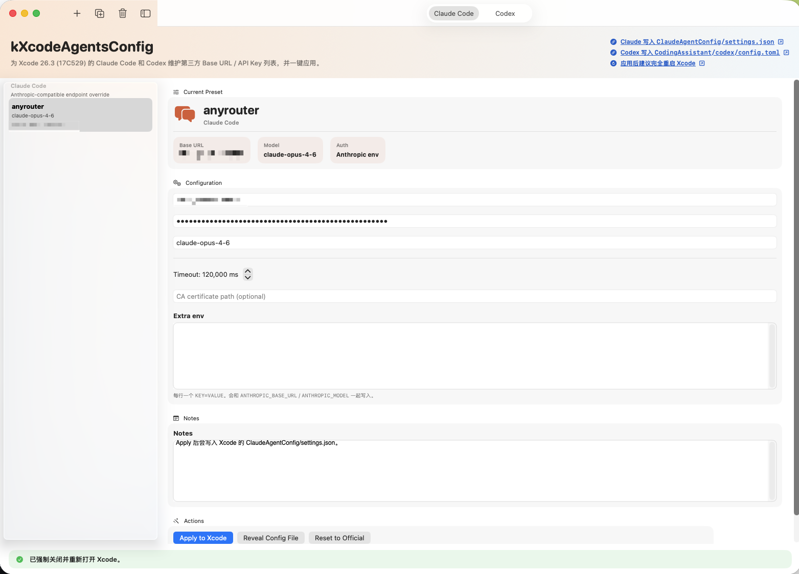
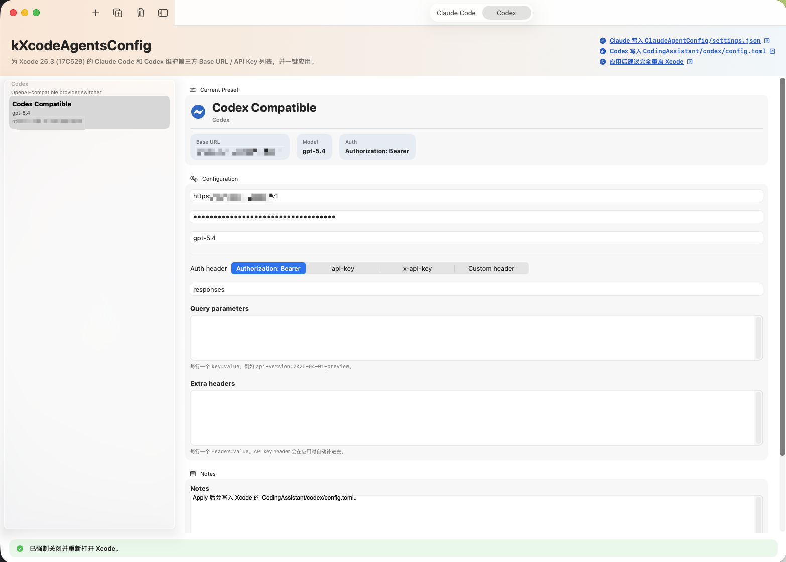

# kXcodeAgentsConfig

A SwiftUI macOS prototype used to manage third-party `Claude Code` / `Codex` Agent configurations for Xcode 26.3 (17C529), allowing one-click application to the local files currently read by Xcode.

 

## Current Capabilities

- Maintain multiple `Base URL + API Key + Model` presets for `Claude Code`.
- Maintain multiple OpenAI-compatible presets for `Codex`, supporting:
  - `Authorization: Bearer`
  - `api-key`
  - `x-api-key`
  - Custom header names
- Support adding extra headers and query parameters for `Codex`.
- Support UI language switching between Chinese and English; the selection is persisted to a local state file.
- Click `Apply to Xcode` to write directly to the configuration location currently used by Xcode.

## App Configuration

- Preset files maintained by the App:
  - `~/Library/Application Support/kXcodeAgentsConfig/presets.json`
  - If an older version `~/Library/Application Support/XcodeAgentsConfig/presets.json` is detected, it will be automatically migrated on first launch.
  - The currently selected UI language is also saved in this state file.
- SwiftPM executable entry point:
  - `Sources/XcodeAgentsConfig/XcodeAgentsConfigApp.swift`
- To ensure the app starts as a normal foreground macOS window when launched via SwiftPM, the following are called during the startup phase:
  - `NSApp.setActivationPolicy(.regular)`
  - `NSApp.activate(ignoringOtherApps: true)`

## Write Locations

### Claude

- `~/Library/Developer/Xcode/CodingAssistant/ClaudeAgentConfig/settings.json`
- `com.apple.dt.Xcode` defaults:
  - `IDEChatClaudeAgentAPIKeyOverride`
  - `IDEChatClaudeAgentModelConfigurationAlias`

### Codex

- `~/Library/Developer/Xcode/CodingAssistant/codex/config.toml`
- The App inserts a managed block with a marker at the top of the file, attempting to preserve your other existing configurations.

## Key Verified Conclusions

### Startup Level

- `swift build` completes normally.
- `swift run` / running `.build/debug/kXcodeAgentsConfig` directly can launch the GUI.
- If the activation policy is not explicitly set, the system recognizes it as `BackgroundOnly` (the process exists but no foreground window appears).
- After correction, the system recognizes it as `Foreground`.

### Claude

- The `Claude` path works via local configuration overrides; it is not an official public Apple configuration entry point.
- The current key method used is:
  - Writing to `~/Library/Developer/Xcode/CodingAssistant/ClaudeAgentConfig/settings.json`
  - Setting `IDEChatClaudeAgentAPIKeyOverride` for `com.apple.dt.Xcode`
  - Setting `IDEChatClaudeAgentModelConfigurationAlias` for `com.apple.dt.Xcode`
- Main environment variables written by the App include:
  - `ANTHROPIC_AUTH_TOKEN`
  - `ANTHROPIC_MODEL`
  - `ANTHROPIC_BASE_URL`
  - Optional `NODE_EXTRA_CA_CERTS`
  - Optional `SSL_CERT_FILE`

### Codex

- `Codex` currently follows the official `config.toml` custom provider approach.
- The App writes a block with a marker at the top of `config.toml`, including core fields such as:
  - `model_provider`
  - `model`
  - `[model_providers.<name>]`
  - `base_url`
  - `wire_api`
  - `http_headers`
  - `query_params`
- After applying the configuration, it is recommended to completely quit and restart Xcode rather than just closing the window.

## Third-party Codex API Test Records

The following conclusions are based on:

- A specific third-party Codex compatible interface
- Interface: `POST /responses`

### Authentication

- `api-key: <KEY>` returns:
  - `401 {"error":"Missing API Key"}`
- `x-api-key: <KEY>` returns:
  - `401 {"error":"Unauthorized"}`
- `Authorization: Bearer <KEY>` passes authentication.

Conclusion:
- Some third-party Codex lines should prioritize `Authorization: Bearer` instead of defaulting to `api-key`.

### Models

- Although `gpt-5.4` appears in the `/models` list, actual calls to Codex `/responses` return:
  - `400`
  - `The 'gpt-5.4' model is not supported when using Codex with a ChatGPT account.`
- `gpt-5-codex` has been tested to return `200`.

Conclusion:
- For certain third-party Codex presets, currently prioritize using:
  - `model = "gpt-5-codex"`

### Request Body

- For some third-party Codex `/responses` interfaces, passing `input` as a direct string results in an error:
  - `Input must be a list`
- The tested minimal working structure is similar to:

```json
{
  "model": "gpt-5-codex",
  "input": [
    {
      "role": "user",
      "content": [
        {
          "type": "input_text",
          "text": "ping"
        }
      ]
    }
  ]
}
```

## Currently Recommended Third-party Codex Preset

- `Base URL`
  - `https://your-codex-provider.example.com/v1`
- `Auth header`
  - `Authorization: Bearer`
- `Model`
  - `gpt-5-codex`
- `Wire API`
  - `responses`

## Local Verification Basis

- The provided gist demonstrates that Claude can bypass the official login flow via `settings.json` + `defaults`:
  - <https://gist.github.com/zoltan-magyar/be846eb36cf5ee33c882ef5f932b754b>
- The following directories actually exist on local Xcode 26.3 (17C529):
  - `~/Library/Developer/Xcode/CodingAssistant/Agents/Versions/17C529/claude`
  - `~/Library/Developer/Xcode/CodingAssistant/Agents/Versions/17C529/codex`
  - `~/Library/Developer/Xcode/CodingAssistant/codex/config.toml`
- Codex provider fields refer to the official OpenAI documentation:
  - <https://developers.openai.com/codex/config>

## Running

Execute in the repository root:

```bash
swift run
```

Or open `Package.swift` directly with Xcode.

## Packaging

Execute in the repository root:

```bash
./scripts/package_app.sh 1.0
```

The script uses `icon.png` in the repository root to generate the app icon.

Generated outputs:

- `dist/kXcodeAgentsConfig.app`
- `dist/kXcodeAgentsConfig-1.0-macOS.zip`

If you need to generate a distributable drag-and-drop installation image:

```bash
./scripts/package_dmg.sh 1.0
```

Generated output:

- `dist/kXcodeAgentsConfig-1.0.dmg`

## Current Limitations

- Third-party integration for `Claude` is a "functional override" based on gists and local behavior; it is not an official public Apple API.
- `Codex` currently utilizes the custom model provider scheme in the official `config.toml`.
- Even if a third-party proxy returns a specific model in `/models`, it doesn't guarantee it is actually usable in the `Codex /responses` scenario; empirical testing is still required.
- The conclusions regarding third-party Codex APIs in this README are based on local verification results and may change according to server-side policy updates.
